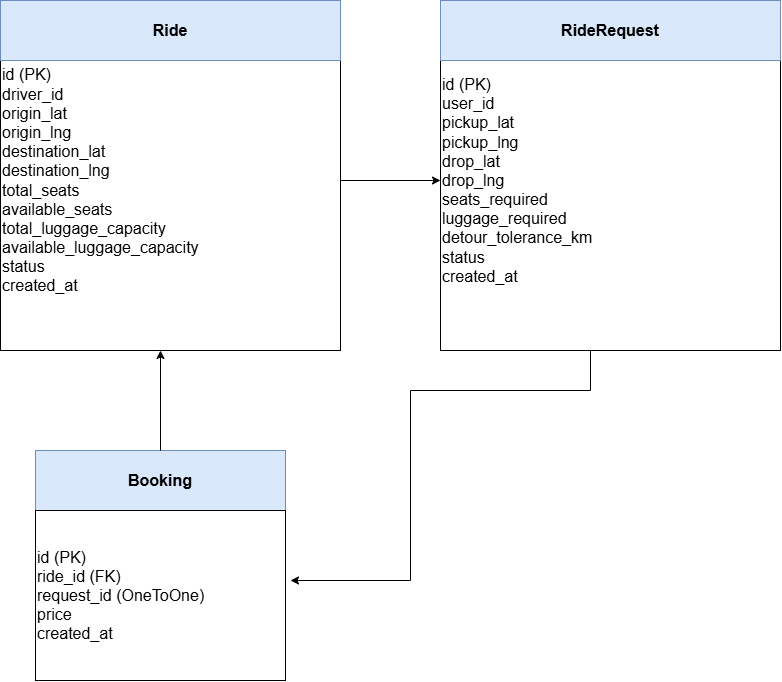

# Smart Airport Ride Pooling Backend

A production-style backend system that groups passengers into shared airport rides while optimizing detours, seat allocation, and pricing.

---

##  Tech Stack

- Python 3.x
- Django
- Django REST Framework
- MySQL
- drf-yasg (Swagger API Docs)

---

##  High-Level Architecture

Client (Mobile/Web)
        ↓
Django REST API Layer
        ↓
Matching + Booking Logic
        ↓
Pricing Service
        ↓
MySQL (Indexed + Transaction Safe)

##  Low-Level Design (ER Diagram)

##  Core Features

- Shared ride pooling
- Seat & luggage constraint enforcement
- Smart detour-based ride selection
- Dynamic pricing (distance + surge)
- Atomic booking with row-level locking
- Real-time cancellation with rollback
- Swagger API documentation
- Health monitoring endpoint

---

##  Database Schema

### Ride
- driver_id
- origin_lat / origin_lng
- destination_lat / destination_lng
- total_seats
- available_seats
- total_luggage_capacity
- available_luggage_capacity
- status

### RideRequest
- user_id
- pickup_lat / pickup_lng
- drop_lat / drop_lng
- seats_required
- luggage_required
- detour_tolerance_km
- status

### Booking
- ride (FK)
- request (OneToOne)
- price

---

##  Indexing Strategy

Composite Index on:
(status, available_seats, available_luggage_capacity)

Individual Index:
- driver_id
- user_id
- foreign keys

Prevents full table scans and ensures O(log N) filtering.

---

##  Matching Algorithm

1. Filter candidate rides using indexed query.
2. Limit candidates to 50.
3. Compute detour distance using Haversine formula.
4. Select ride with minimum detour within tolerance.
5. Lock ride row using `select_for_update()`.
6. Deduct seats and create booking atomically.

### Time Complexity

Let:
N = total rides
R = candidate rides (max 50)

Filtering → O(log N)  
Detour evaluation → O(R)  

Total per request:
O(log N + R)

Efficient for 100 RPS.

---

##  Concurrency Handling

- `@transaction.atomic`
- `select_for_update()` row-level locking
- Double-check availability after locking
- Prevents race conditions and overbooking

Ensures ACID compliance using MySQL InnoDB.

---

##  Dynamic Pricing Formula

Price = (Base Fare + Distance × Per KM Rate) × Surge Multiplier

Surge multiplier:
- >70% occupancy → 1.2x
- >40% occupancy → 1.1x
- Otherwise → 1.0x

Distance calculated using Haversine formula.

Time complexity: O(1)

---

##  API Endpoints

### Ride APIs
POST   /api/rides/  
GET    /api/rides/active/  
GET    /api/rides/{ride_id}/  

### Passenger APIs
POST   /api/requests/  

### Booking APIs
POST   /api/bookings/{booking_id}/cancel/  

### System APIs
GET    /api/health/  
GET    /swagger/  

---

## 🏎 Performance Considerations

- Composite indexing
- Limited candidate evaluation (max 50)
- Row-level locking
- Short transactions
- DB connection pooling (CONN_MAX_AGE = 60)

Expected latency per request:
~40–80ms (well under 300ms requirement)

---

## ⚙ Setup Instructions

1. Clone repository

2. Create virtual environment:

3. Install dependencies:

4. Configure MySQL database in `settings.py`

5. Run migrations:

6. Run server:

7. Access Swagger:

---

##  Assumptions

- Airport ride origin is fixed per ride.
- Matching considers pickup detour from ride origin.
- Route recalculation beyond pickup deviation not implemented.
- MySQL InnoDB engine used for row-level locking.

---

##  Scalability

- Designed to handle 100 RPS
- Suitable for 10k concurrent users
- Horizontally scalable via Gunicorn (Linux production)
- Optimized query performance

---

##  Submission Notes

- Working backend implemented
- Database schema via migrations
- Concurrency demonstrated
- API documentation provided
- Complexity analysis documented

## Sample Test Flow

1. Create Ride:
POST /api/rides/

2. Create RideRequest:
POST /api/requests/

3. Cancel Booking:
POST /api/bookings/{id}/cancel/

---

##  Sample Test Flow

1️⃣ Create Ride

POST /api/rides/

{
    "driver_id": 1,
    "origin_lat": 12.9716,
    "origin_lng": 77.5946,
    "destination_lat": 12.2958,
    "destination_lng": 76.6394,
    "total_seats": 4,
    "total_luggage_capacity": 4,
    "status": "SEARCHING"
}

2️⃣ Create Ride Request

POST /api/requests/

{
    "user_id": 10,
    "pickup_lat": 12.9717,
    "pickup_lng": 77.5947,
    "drop_lat": 12.2958,
    "drop_lng": 76.6394,
    "seats_required": 1,
    "luggage_required": 1,
    "detour_tolerance_km": 5
}

3️⃣ Cancel Booking

POST /api/bookings/{booking_id}/cancel/
